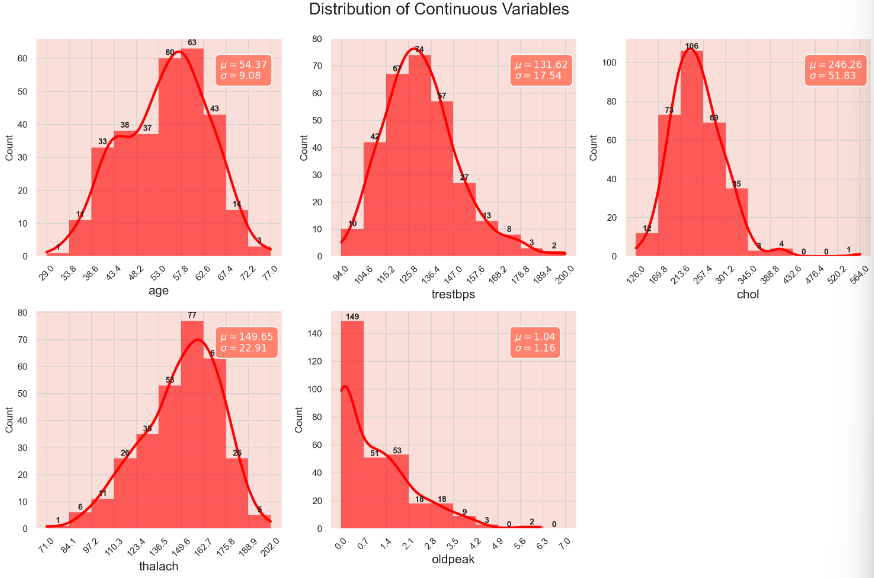
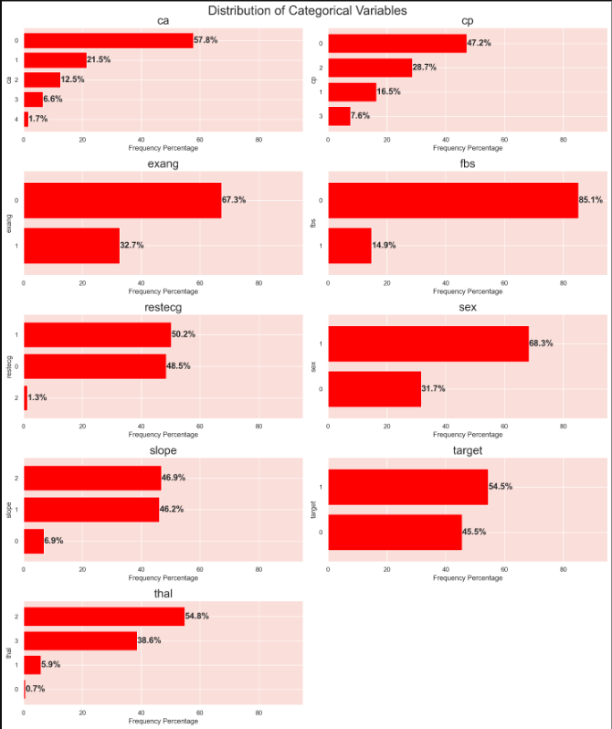
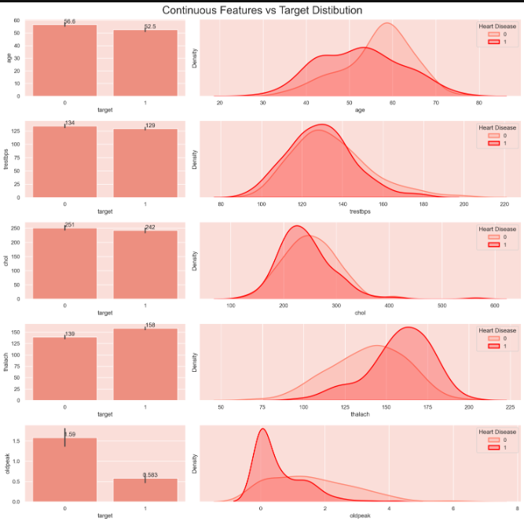
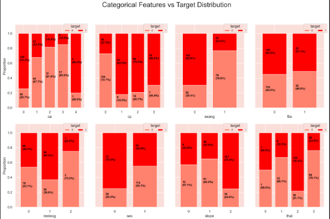
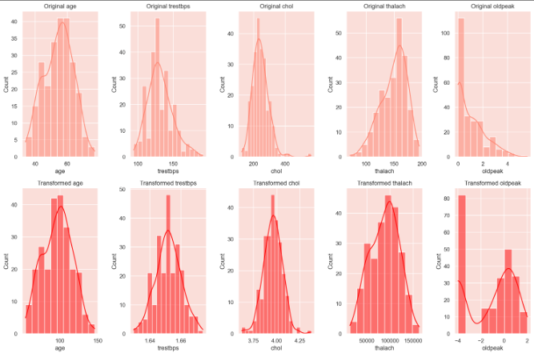
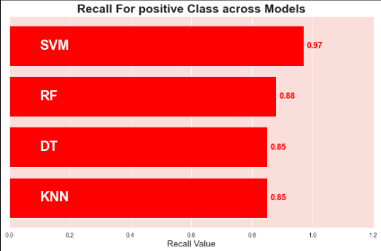

#  Cardiac Diagnosis using Machine Learning

This project aims to **predict the presence of cardiac disease** using multiple machine learning classification models.  
It is built on the **Heart Disease UCI dataset** (`heart.csv`), which includes various clinical parameters of patients.  
The focus of this project is on developing, evaluating, and comparing models to identify which provides the most reliable predictions — particularly emphasizing **Recall**, as it is the most crucial metric in medical diagnosis.

---

##  Objective

Heart disease diagnosis requires high sensitivity in detecting actual positive cases.  
The project focuses on:
- Exploring and transforming patient data for improved model input  
- Building and evaluating multiple classification models  
- Comparing results primarily based on **Recall**, as missing true cases can be critical in healthcare  
- Visualizing insights from both raw and transformed data  

---
##  Folder Structure

```bash
Cardiac-Diagnosis/
│
├── Cardiac Diagnosis.ipynb
├── Graphical_results/
│   ├── Categorical_features_vs_Target_distribution.png
│   ├── Comparision_beyween_Original_&_Transformed.png
│   ├── Continuous_features_vs_Target_distribution.png
│   ├── Distribution_of_Continuous_variables.png
│   ├── Distribution_of_categorical_variables.png
│   └── Recall_for_diff_Models.png
├── heart.csv
└── README.md
```
---
##  Dataset Overview

The dataset (`heart.csv`) contains patient data across various clinical and biological parameters.  
Some of the key features include:

- **Age** – Patient’s age  
- **Sex** – Gender (1 = male, 0 = female)  
- **Chest Pain Type (cp)** – Type of chest pain experienced  
- **Resting Blood Pressure (trestbps)** – Measured in mm Hg  
- **Cholesterol (chol)** – Serum cholesterol in mg/dl  
- **Fasting Blood Sugar (fbs)** – Indicates if fasting blood sugar > 120 mg/dl  
- **Resting ECG (restecg)** – Resting electrocardiographic results  
- **Maximum Heart Rate (thalach)** – Achieved maximum heart rate  
- **Target** – Indicates heart disease presence (1 = disease, 0 = no disease)

---

##  Models Used

The following machine learning models were implemented and evaluated:

1. **Support Vector Machine (SVM)**  
2. **K-Nearest Neighbors (KNN)**  
3. **Decision Tree**  
4. **Random Forest**

All models were evaluated using **Accuracy**, **Precision**, **Recall**, and **F1-score**.  
Given the medical nature of the task, **Recall** was prioritized, ensuring that true cardiac patients are correctly identified.

---

##  Data Visualizations

To better understand the data distribution and model performance, several visual analyses were conducted.

### 1. Distribution of Continuous Variables


### 2. Distribution of Categorical Variables


### 3. Continuous Features vs Target Distribution


### 4. Categorical Features vs Target Distribution


### 5. Comparison Between Original and Transformed Data


### 6. Recall Comparison for Different Models


---

##  Model Performance Summary

| Model                  | Accuracy | Recall | Precision | F1-Score |
|------------------------|-----------|---------|------------|-----------|
| SVM                    | 0.82      | **0.97** | 0.73       | 0.83      |
| KNN                    | 0.79      | 0.91     | 0.70       | 0.79      |
| Decision Tree (Pruned) | 0.80      | 0.89     | 0.74       | 0.81      |
| Random Forest          | 0.84      | 0.93     | 0.77       | 0.85      |

> **Inference:**  
> The **Support Vector Machine (SVM)** model outperformed others with a Recall of **0.97**, making it the most effective for identifying cardiac cases.  
> This is crucial for medical predictions, where missing a true positive could have severe consequences.

---

##  Conclusion

- The **SVM model** achieved the highest Recall, ensuring that most cardiac patients are correctly diagnosed.  
- **Decision Tree pruning** improved generalization by reducing overfitting and enhancing validation accuracy.  
- The **Random Forest** model provided balanced performance across all metrics, making it a strong secondary choice.  
- Data transformations and feature scaling significantly improved model performance, as shown in comparative visualizations.

Overall, the project demonstrates the application of **machine learning in medical diagnosis** — emphasizing the importance of **Recall-driven evaluation** in healthcare prediction tasks.

---

##  Tools & Technologies

- **Programming Language:** Python 3.10+  
- **Environment:** Jupyter Notebook  
- **Libraries Used:**
  - `pandas`
  - `numpy`
  - `matplotlib`
  - `seaborn`
  - `scikit-learn`


